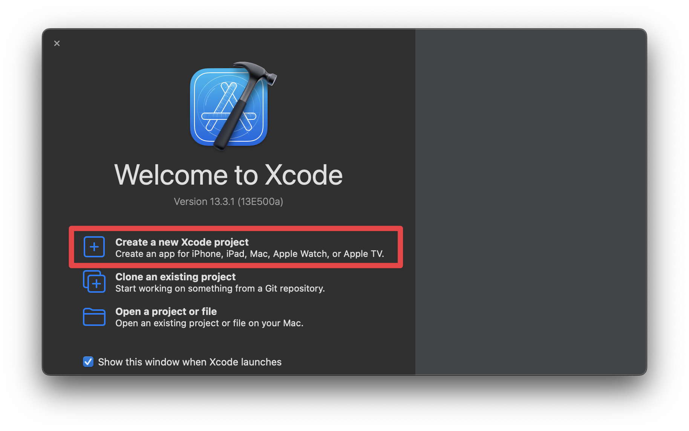
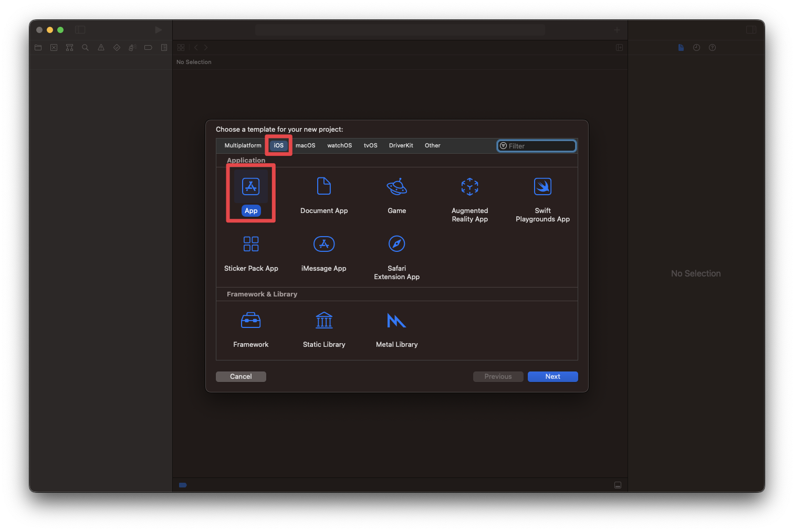
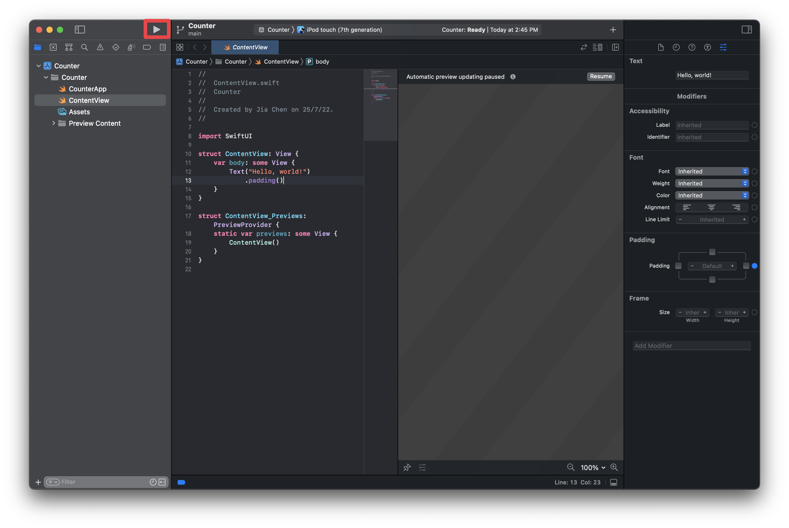

---
# try also 'default' to start simple
theme: geist
css: style.css

# random image from a curated Unsplash collection by Anthony
# like them? see https://unsplash.com/collections/94734566/slidev
background: https://source.unsplash.com/collection/94734566/1920x1080
# apply any windi css classes to the current slide
class: 'text-center'
# https://sli.dev/custom/highlighters.html
highlighter: shiki
lineNumbers: false

layout: cover

info: |
  ## iOS
---

# App Development with Swift & SwiftUI

Part I

Open slides here: https://ios.np-overflow.club/part-1/

<div class="pt-12">
  <span @click="$slidev.nav.next" class="px-2 py-1 rounded cursor-pointer" hover="bg-white bg-opacity-10">
    Press Space for next page <carbon:arrow-right class="inline"/>
  </span>
</div>

---

# Overview

- 💻 [**macOS** - Welcome to the Mac!](4)
- 👋 **Hello World** - Launch Xcode, create a project and run it!
- 📐 **Layout** - Use stacks to layout the app
- 🌄 **Images and assets** - Add an image, ideally of Qin Guan
- 🛠 **Modifiers** - Customise Views using modifiers
- 👀 **State** - Set the views and modify the state

<style>
h1 {
  background-color: #2B90B6;
  background-image: linear-gradient(45deg, #4EC5D4 10%, #146b8c 20%);
  background-size: 100%;
  -webkit-background-clip: text;
  -moz-background-clip: text;
  -webkit-text-fill-color: transparent;
  -moz-text-fill-color: transparent;
}
</style>

---
layout: image-right
image: assets/demo.gif
---
# Demo

It's a clicker, with ✨style✨, and Qin Guan

---
layout: cover
---
# 🖥 Welcome to macOS
## A better operating system
--- 

# Keyboard Shortcuts

* For most keyboard shortcuts you’re used to, think of Command (⌘) as your Control key.
* ⇧ represents the Shift key.

## Important shortcuts

- <kbd>⌘Space</kbd> opens up spotlight search 
  - A fancy search bar where you can open anything.
  - Similar to your Start menu on Windows.
- <kbd>⌘C</kbd> and <kbd>⌘V</kbd> is copy and paste respectively
- <kbd>⌘Z</kbd> and <kbd>⌘⇧Z</kbd> is undo and redo respectively

---
layout: center
---

— Apple, Platforms State of the Union, WWDC, June 2022

---

# SwiftUI
- Apple’s new app development framework for building modern user interfaces
  - Build and prototype full-fledged iOS apps in Swift
  - Allows building for iPadOS, macOS, watchOS, tvOS
- Modern, *declarative* syntax for building user interfaces
  - Allows developers to “just say what your interface should do”
  - Gentler learning curve than UIKit, the previous framework
  - Easy to add animations and interactivity
  - Great for prototyping and beginners

---
layout: cover
---
# 👋 Hello World!
## Create a SwiftUI project and run it!
--- 

# Open up Xcode
- Type <kbd>⌘Space</kbd> and search for Xcode and click on the result


---

# Create a project
- Select **Create a new Xcode project**
- Select **iOS**, then **App** and press **Next**


---
layout: image-right
image: assets/projectsetup.png
---

# Project Setup

- For Product Name, type in **Counter**.
- For Team, select **None**.
- For Organization Identifier, type in **club.np-overflow**.
  - The convention is the reverse of your domain name.
- For Interface, select **SwiftUI**.
- For Language, select **Swift**.
- Make sure **Use Core Data** and **Include Tests** are unchecked.
- Click Next and save the project on the Desktop.

--- 

# Run the project
- Click the ▶ icon in the menubar to run the app!



---
layout: image-left
image: assets/simulatorhelloworld.png
---

# Simulator
- An iPhone (or iPod) Simulator will appear
- Hey look, it says "Hello, World!"
- You created your first SwiftUI app!

---
layout: cover
---
# 📐 Layout
## Make use of stacks to create custom layouts

--- 

# Understanding the code
```swift {all|10-15|12-13}
//
//  ContentView.swift
//  Counter
//
//  Created by Jia Chen Yee on 25/7/22.
//

import SwiftUI

struct ContentView: View {
    var body: some View {
        Text("Hello, World")
            .padding()
    }
}

struct ContentView_Previews: PreviewProvider {
    static var previews: some View {
        ContentView()
    }
}
```

---
layout: image-right
image: assets/vstack.png
---
# VStack

- Vertical Stack Views
- Views within its curly braces will be arranged vertically

```swift
VStack {
    Text("Apple")
    Text("Banana")
    Text("Strawberry")
}
```

---
layout: image-right
image: assets/hstack.png
---
# HStack

- Horizontal Stack Views
- Views within its curly braces will be arranged horizontally

```swift
HStack {
    Text("Apple")
    Text("Banana")
    Text("Strawberry")
}
```

---